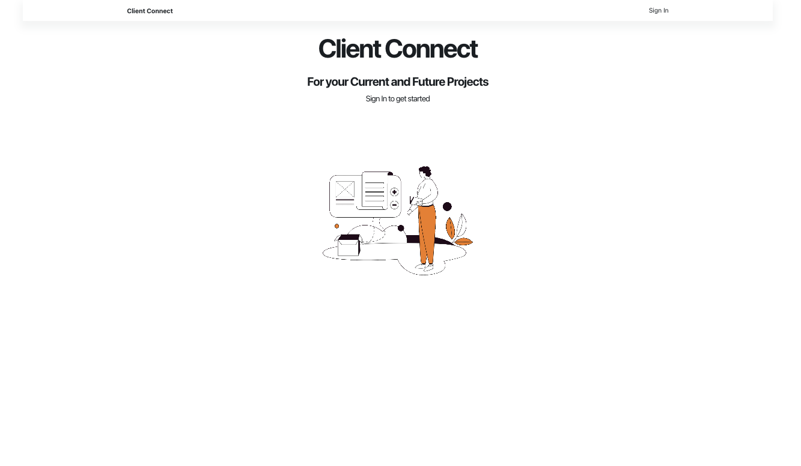
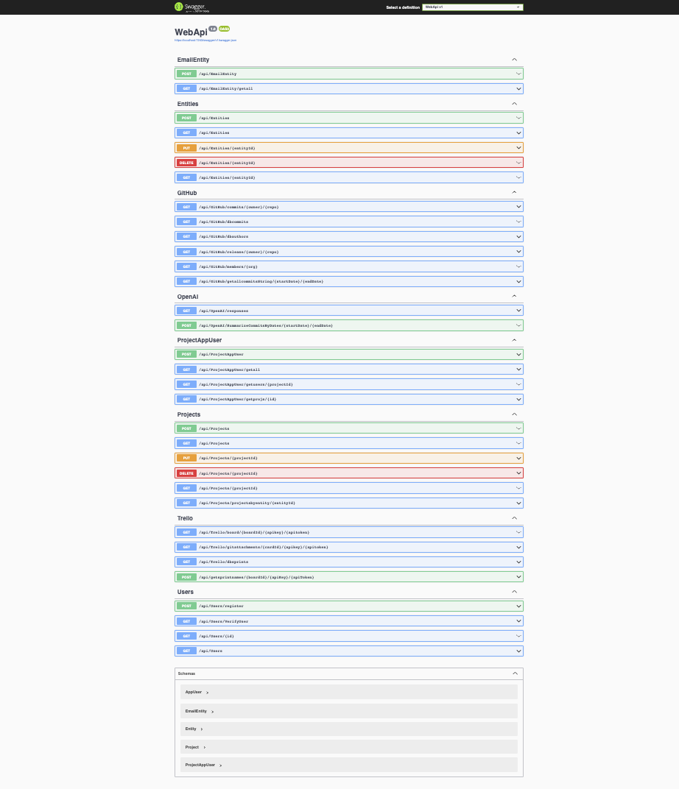

# Client Connect
## EyeCue Lab Summer 2023 Internship
## Authors 

- [Brishna Bakshev](https://github.com/bbakshev)
- [Stephen Zook](https://github.com/Zookerman3)
- [Justin Lee](https://github.com/JustinUrf)
- [Eliot Gronstal](https://github.com/elgrons)
- [Erin Timlin](https://github.com/erintimli01)
- EyeCue Lab Mentors



## 📂 Table Of Contents

- [Description](#description)

- [Technologies Used](#technologies-used)

- [Project Setup](#project-setup)
  - [Scripts](#scripts)

- [Known Issues](#known-issues)

- [Stretch Goals](#stretch-goals)

## Description <a id="description"></a> 

Client Connect is a web application that acts as a portal for customers and project management of a software development company. Client Connect aims to allow partners to visualize the contributions of the team and indvidiual developer on each project, sprint-by-sprint. The contributions are an organization of third-party integrations including Trello, GitHub, and OpenAI to provide summarizations of project Commits for stakeholders.

Furthermore, this project looks to add real-time communication libraries to enable clients and administrators to work at the same time as well as authorization to allow Admin users full access and Client users to only see projects that are they are associated with.

## Technologies Used <a id="technologies-used"></a>

* _React_
* _Next.js_
* _ASP.NET Core 6_
* _Entity Framework_
* _C#_
* _TypeScript_
* _HTML/CSS_
* _Material UI_
* _NextUI_
* _Tailwind_
* _PostgresQL_
* _OpenAI_
* _GitHub_
* _Trello_
* _GoogleAuth/NextAuth_
* _Figma_
* _Docker_
* _VS Code_

## Project Setup <a id="project-setup"></a>

0. Create .env file in the `customer-portal` directory and add the following code:
 ```
 GOOGLE_CLIENT_ID = [YOUR-GOOGLE-CLIENT-ID] 
 GOOGLE_CLIENT_SECRET = [YOUR-GOOGLE-SECRET] 
 NEXTAUTH_URL = http://localhost:3000/ 
 JWT_SECRET = [YOUR-JWT-SECRET] 
 ``` 
 Create appsettings.Development.json in the `WebApi` root folder with the following contents: 
 ```
 {
  "Logging": {
    "LogLevel": {
      "Default": "Information",
      "Microsoft.AspNetCore": "Warning"
    }
  },
  "AllowedHosts": "*",
  "PostgreSqlConnectionString": "Server=localhost;Port=5432;Database=ClientPortal1;User Id=[YOUR-ID];Password=[YOUR-PASSWORD];",
    "Authentication": {
      "Google": {
        "ClientId": ["YOUR-CLIENT-ID"],
        "ClientSecret": ["YOUR-CLIENT-SECRET"]
      }
  }
}
```

1. Clone this repo into your desktop.
2. Navigate to the project directory `customer-portal` and run `$ npm install`.
3. Use `npm run dev` in order to run locally on `localhost:3000`.
4. Navigate to webapi/WebApi and run `dotnet restore`. 
5. NOTE: Must have PostgresQL installed to successfully create the database. Create Entity Framework database migrations by running `dotnet ef migrations add initial` to build schema. Then, run the command `dotnet ef database update`. 
6. Use `dotnet watch run` in order to run the backend API. This can be viewed through the Swagger.ui at `localhost:7243`.

### Swagger Documentation

To view the Swagger documentation for the WebApi, launch the project using `dotnet watch run` using Terminal or Powershell, then input the following URL into your browser: `https://localhost:7243/swagger/index.html`



### Creating a New Instance in Postman or Swagger

- To utilize the POST request and generate a new POST request where applicable, the following information structure is required, while the actual information input can vary.

Register a User with the following .json data as a template:
```
[
  {
    "Id": "134",
    "UserName": "exampleEmail@gmail.com",
    "Email": "exampleEmail@gmail.com",
    "EntityId": "ca2e28bc-1bd8-4e72-898c-edc028676877",
  }
]
```

Register an Entity (aka a "Client" company) with the following .json template:
```
[
  {
    "entityId": "ca2e28bc-1bd8-4e72-898c-edc028676877",
    "companyName": "EyeCue Lab"
  }
]
```

Register an Entity Email (aka create a Client user) with the following .json template:
```
[
  {
    "EmailEntityId": "1",
    "Email": "exampleEmail@gmail.com",
    "EntityId": "ca2e28bc-1bd8-4e72-898c-edc028676877"
  }
]
```
Register an Entity Project with the following .json template:
```
[
  {
    "ProjectId": "9bf535b3-cf39-4374-8fbe-51a96bcef683",
    "EntityId": "ca2e28bc-1bd8-4e72-898c-edc028676877",
    "ProjectName": "EyeCue Lab Project"
  }
]
```

Register an Project App User (the association between a Project and a Client or Admin User) with the following .json template:
```
[
  {
    "ProjectAppUserId": "1",
    "ProjectId": "9bf535b3-cf39-4374-8fbe-51a96bcef683",
    "Email": "exampleEmail@gmail.com"
  }
]
```

## Scripts <a id="scripts"></a>

To run the project locally you'll need to open two terminals in your Code Editor to differentiate between the projects in the monorepo.

### Front End:
Starting within the `summer-internship-2023` main folder enter `cd customer-portal` into the terminal. This will bring you into the primary folder for project's front end.

From within the `customer-portal` directory type `npm i` if it's your first time setting up the project followed by `npm run dev` to run the project locally. 

A local instance of the project can be viewed at `http://localhost:3000`.

### Back End:

From the `summer-internship-2023` main folder enter `cd webapi` followed by `cd WebApi` into the terminal. This will bring you into the primary folder for the backend web API.

Enter the command `dotnet watch run` to run the API locally (this presumes you have already set up the database according to the earlier instructions in this document). 

The Web API details can be viewed via Swagger at `localhost:7243`.

## Known Issues <a id="known-issues"></a>

* There is a bit of a latency issue, but everything *does* work - that's more a of a "lesson learned", if you will.

* Please reach out with any questions or concerns to any or all of us, we'd love to hear from you: [b.bakshev@gmail.com](b.bakshev@gmail.com), [eliot.lauren@gmail.com](eliot.lauren@gmail.com), [lee.justin001126@gmail.com](lee.justin001126@gmail.com), [erintimlin@gmail.com](erintimlin@gmail.com), or [szook7@gmail.com](szook7@gmail.com)

## Stretch Goals <a id="stretch-goals"></a>

* Project deployment

* Add more profile functionality

* Add an option for an Admin user to upload an invoice for a client

## License
Copyright (c) 2023 Brishna Bakshev, Stephen Zook, Justin Lee, Eliot Gronstal, and Erin Timlin _[MIT](https://choosealicense.com/licenses/mit/)_